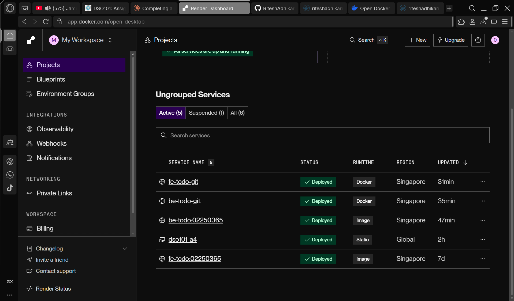

RiteshAdhikari_02250365_DSO101_A1

## Todo App - CI/CD Assignment

A full-stack Todo application with Frontend (React), Backend (Node.js/Express), and Database (PostgreSQL), deployed using Docker and Render.

---

## Step 0 - Prerequisites
- Built a full-stack Todo app with:
  - **Frontend**: React + Vite (Add/Edit/Delete tasks)
  - **Backend**: Node.js + Express (CRUD API)
  - **Database**: PostgreSQL (persistent storage)
- Used `.env` files for environment variables
- Added `.env` to `.gitignore` to prevent committing secrets

---

## Part A - Deploying Pre-built Docker Images

### Step 1 - Build and Push Images to Docker Hub

Built and pushed backend image:
```bash
docker build -t riteshadhikari/be-todo:02250365 .
docker push riteshadhikari/be-todo:02250365
```

Built and pushed frontend image:
```bash
docker build -t riteshadhikari/fe-todo:02250365 .
docker push riteshadhikari/fe-todo:02250365
```

**Docker Hub:** https://hub.docker.com/u/riteshadhikari

[ADD SCREENSHOT OF DOCKER HUB SHOWING BOTH IMAGES HERE]

### Step 2 - Deploy on Render

#### Database
- Created a PostgreSQL database on Render
- Named: `todo-db`

[ADD SCREENSHOT OF DATABASE ON RENDER HERE]

#### Backend Service
- Created Web Service using existing Docker Hub image
- Image: `riteshadhikari/be-todo:02250365`
- Added environment variables: DB_HOST, DB_USER, DB_PASSWORD, DB_NAME, DB_PORT, PORT
- Live URL: https://be-todo-02250365.onrender.com

[ADD SCREENSHOT OF BACKEND SERVICE LIVE ON RENDER HERE]

#### Frontend Service
- Created Web Service using existing Docker Hub image
- Image: `riteshadhikari/fe-todo:02250365`
- Added environment variable: VITE_API_URL
- Live URL: https://fe-todo.onrender.com

---

## Part B - Automated Image Build and Deployment

### Setup
- Connected GitHub repository to Render
- Configured `render.yaml` for multi-service deployment
- Created two new services that build directly from the Git repository:
  - `be-todo-git` - builds from `backend/Dockerfile`
  - `fe-todo-git` - builds from `frontend/Dockerfile`

### Auto-Deploy Test
- Every push to the `main` branch automatically triggers a new build and deployment on Render
- Tested by pushing a small change and observing Render auto-deploy

**Live URLs:**
- Backend: https://be-todo-git.onrender.com
- Frontend: https://fe-todo-git.onrender.com
---

## Assignment 3 - GitHub Actions CI/CD Pipeline

### Workflow
- Created `.github/workflows/docker-deploy.yml`
- On every push to `main`:
  1. Logs into Docker Hub using GitHub Secrets
  2. Builds backend and frontend Docker images
  3. Pushes images to Docker Hub with `latest` tag
  4. Triggers Render deployment via webhook

### GitHub Secrets Used
- `DOCKERHUB_USERNAME`
- `DOCKERHUB_TOKEN`
- `RENDER_DEPLOY_HOOK`

### Screenshots


### Live Deployment
- Backend: https://be-todo-02250365.onrender.com

A1 outcome screenshots:

